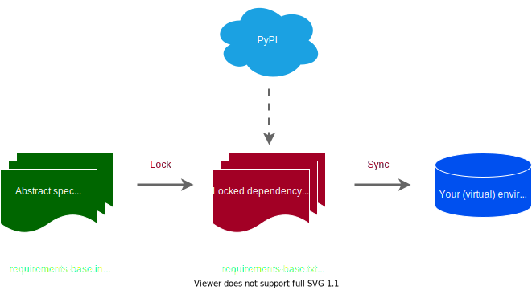

# Pipt
## ✨ Introduction
Pipt is a small (KISS) Bash-based[^1] convenience wrapper around [pip-tools](https://github.com/jazzband/pip-tools) providing deterministic venv handling for Python application development.


So what does that mean, and how does it compare to similar tools like Pipenv or Poetry?

### 👶 Small / KISS
Pipt is much smaller and has only a small fraction of the number of features compared to e.g. Pipenv or Poetry:
* Pipt is just a <1000 lines[^2] Bash[^1] script
* Only supports typical Linux with Bash and CPython >=3.7. **Windows is at most a 3rd class citizen here ;-)**
* Only supports the most-typical application development scenario: runtime + dev dependencies. No package development or publishing workflows.
* For deployments / CI you can always fall back to pure pip-tools. Keep your production tooling small, simple and battle-tested. No need to trust pipt there!

### :pushpin: Deterministic venv handling
Pipt uses pip-tools to lock / freeze ("compile" in pip-tools terminology) dependencies and sync them with a virtual environment. This includes
* **venv handling**: creates, syncs, activates the project virtual environment for you
* **deterministic**: Enforces that this venv is always up-to-date when using it. This is achieved by storing some additional information / hashes in the code repository and in the venv. Examples:
    * When the project Python version is updated, pipt automatically recreates the venv from scratch.
    * Vice-versa it does not let you sync locked dependencies that were locked against another Python version.
    * It at least warns you if it thinks the locked dependencies were not derived from the specified dependencies in the `requirements*.in` files.

### 🎀 Convenience wrapper around pip-tools
pip-tools' dependency solving and locking mechanisms are good enough and fast. No need to reinvent the wheel. Pipt just provides some convenience around it:
* Simple to use commands like `pipt shell` or `pipt run -- COMMAND`, similar to what Pipenv or Poetry provide. Furthermore:
    *  `pipt lock` and `pipt upgrade` to manage locking and upgrading. `pipt sync` for manual syncing and `pipt sync-system` for no-venv syncing of your system.
    *  `pipt add` and `pipt remove` to add / remove dependency specs.
* Creates all necessary files if not present. Start your projects from scratch by simply running `pipt shell`.

### 💡 So ...  why?
I am annoyed by the complexity of Pipenv and Poetry, which try to support way too many use cases and setups. They have become difficult to maintain and consequently have hundreds of open issues. Therefore I do not want to use them for production applications. On the other side I envy their convenience.

Another point is seamless team collaboration: Syncing automatically and making sure that every developer's venv is always up-to-date reduces friction.

## 🚀 Getting Started
### 💾 Installation
**Prerequisites:** You need a 
* typical Linux OS
* with a recent version of Bash and GNU coreutils
* and of course the Python versions you want to use in your projects.

Now simply download the `pipt` file from this repository, place it somewhere in your PATH and make it executable. After that, running `pipt` on the command line should show its usage instructions.

Alternatively you can store the `pipt` file directly in your project repository and make it executable. In this case, invoke it via `./pipt` from the same directory.

### 👐 Basic usage
`pipt` must always be invoked with deactivated virtual environment. It will tell you so if it detects itself to be running inside one.
Run
```bash
pipt
```
to show the usage instructions. Run `pipt help` to get more detailed help.

#### 🌱 Creating and activating virtual environment

Run
```bash
pipt shell
```

in a new project. This will
* create all necessary files (e.g. requirements*.in files, ...)
* create a virtual environment
* activate it 

📋 **Notes**: 
* You can deactivate the virtual environment by pressing CTRL+D or running `exit` or `deactivate` in your terminal.
* By default pipt will use your system Python. To use a specific Python minor version just edit the PY_VERSION entry in the generated `pipt_locks.env` file to your desired minor version (e.g. `3.10`) and run `pipt lock`.
* You should add all created files to version control. The venv and its contents should never be added to version control.
* By default the virtual environment is stored somewhere in your home directory and not in the project directory. The exact path is shown when running pipt commands.
* If you run `pipt shell` in an existing pipt-managed project it will of course use the existing files.

You may now add dependencies via `pipt add DEPENDENCY`, e.g. `pipt add "requests<3"`. To understand what happens let's recap some basic dependency management concepts.

#### 📚 Interlude: Basic dependency management concepts
##### Runtime/prod versus development dependencies
Pipt targets the typical application development project, which has **runtime/prod dependencies** and **dev dependencies**:
* **Runtime/prod dependencies**: Are necessary to run your application (in production). They are specified in the `requirements.in` file and locked dependencies are written to the `requirements.txt` file by pipt (respectively pip-tools).
* **Dev dependencies**: Typically your unit testing framework, code formatter, static type checker and/or static code quality checker. These dependencies are necessary during development or in CI pipelines to run unit tests etc there. They are installed additionally to the runtime dependencies in these contexts. Their specifications go into the `requirements-dev.in` file and locked dev dependencies are written to the `requirements-dev.txt` file. The locked runtime dependencies are defined to be a constraint on them.

**Notes**: 
* Additionally pipt manages the necessary package management dependencies (like pip and pip-tools) in a `requirements-base.in` file and a `requirements-base.txt` file. They are constraints to both runtime and dev dependencies. You typically don't have to care about them.
* [pip-tools' layered system](https://github.com/jazzband/pip-tools#workflow-for-layered-requirements) allows for more involved setups, but pipt restricts itself to the setup described above.
* pipt defaults to sync both the runtime+dev dependencies when running `pipt shell` or `pipt run` or `pipt sync`. Add `--prod` to sync only the runtime/prod dependencies instead. On the other hand the `pipt add` command described below defaults to adding dependency specifications to the runtime/prod dependencies and you have to use `pipt add --dev` to add them to the dev dependencies instead.

##### Abstract dependency specification and locking
Dependencies are managed using the typical modern workflow:



(inspiration: completely analogous [pip-tools picture](https://github.com/jazzband/pip-tools/raw/master/img/pip-tools-overview.svg) )

=> **abstract dependency specification with version constraints**

=> locking (sometimes called "resolving",  "freezing" or "compiling") process

=> **locked explicit versions** 

=> syncing

=> **synced environment/system**

The abstract dependency specifications (like `requests<3`, `pandas>=1.3,<1.4`) go into the `requirements*.in` files. The locking process automatically generates the corresponding `requirements*.txt` files which contain explicit fixed versions like `requests==2.27.1` (furthermore a hash is fixed there), which typically are not edited by a human.

Having locked dependencies ensures that the exact same dependencies can be installed on another system. This guarantees seamless collaboration in your team (avoid the "runs on my system" discussions) and saves you from unpleasant surprises in production.

#### ➕ Adding / Removing dependencies
##### Using pipt
The simple way is to run
```bash
pipt add "requests<3" "pandas>=1.3,<1.4"
```
or
```bash
pipt add --dev pytest
```
to add dependencies.

The first command adds `requests` and `pandas` with some version constraints to the runtime dependencies in `requirments.in` and the second command adds `pytest` to the dev dependencies in `requirements-dev.in`. Pipt locks your dependencies and the next time you enter your virtual environment via `pipt shell` it will automatically be synced with the new locked dependencies.

Removing can be achieved by running
```bash
pipt remove requests
```
This will remove requests from both runtime and dev dependencies.

📋 **Note**: pipt runs some Python code here since the most reliable code to parse requirement files comes from using pip as a module. This Python code is kept simple and may not handle every edge case. You can always fall back to directly editing the `requirments*.in` files if you experience any problem or do not trust that code or pipt:

##### By editing `*.in` files directly
Simply edit the `requirement*.in` files and run `pipt lock` or `pipt upgrade` after that.

#### 🔒 Locking and Upgrading
```bash
pipt lock
```
will lock all your dependencies. After that the next time you use your virtual environment for example by running `pipt shell` it will be synced to the updated lock files.

Note that pipt saves some hashes in the current directory in the `pipt_locks.env` file. They are necessary for pipt to determine whether your dependencies need re-locking, for example if `requirements*.in` files changed. The `pipt_locks.env` file should be added to version control.

By default `pipt lock` does not try to upgrade already locked dependencies if that is not necessary. Use
```bash
pipt upgrade
```
if you want to upgrade all dependencies. This will delete the existing `requirements*.txt` files and start the resolving process from scratch. Also a good option if locking somehow gets stuck.

#### 🖥️ Running commands
There is
```bash
pipt run [--prod] [--silent] -- COMMAND
```
which runs `COMMAND` in the activated, synced virtual environment. `COMMAND` can be an arbitrary shell command with arguments etc. 

Like `pipt shell` and `pipt sync` it defaults to sync to the dev dependencies and you can restrict it to sync to just the runtime dependencies using the `--prod` option. 

Furthermore the `--silent` option surpresses pipt output to stdout.

#### 🔄 Syncing manually
You can sync your virtual environment manually using the `pipt sync` command. This will create the virtual environment if not existing and defaults to syncing both prod+dev dependencies. Use the `--prod` option to only sync the runtime dependencies.

Note that manual syncing usually is not necessary during development, since pipt commands like `pipt shell` or `pipt run` automatically sync if necessary.

Syncing manually ist more useful in CI / deployment scripts to set up a fully synced virtual environment. See the below for instructions on syncing without a venv.

#### 🐍 Changing the Python version
First make sure that the desired Python minor version (e.g. `3.9`)
* is either available on your PATH in the format `python3.9` or just `python`.
* or its path is set explicitely in the generated configuration file `pipt_config.env` using the `PYTHON_INTERPRETER` variable.

Then edit the PY_VERSION entry in the generated `pipt_locks.env` file to your desired minor version (e.g. `3.9`) and run `pipt lock`.

The next time you run one of the typical pipt commands like `pipt shell`, the virtual environment will be recreated and synced against the new version and the re-locked dependencies.

Remember to add the changes in all relevant files to version control.

#### ❗ Install dependencies in production environments
##### with venv
Use `pipt sync` as described above.
##### without venv: pipt sync-system
Pipt comes with a `pipt sync-system` command which allows to sync the locked dependencies to the system site packages of Python, i.e. it does not use a venv.

Like `pipt sync` it defaults to syncing both prod+dev dependencies. Use the `--prod` option to only sync the runtime dependencies.

This is often used on production systems or in Dockerfiles to avoid the overhead of a virtual environment there. This repository contains a [demo Dockerfile](https://github.com/stewit/pipt/blob/main/Dockerfile).

##### 🦺 Falling back to pip-sync
If you do not want to trust pipt you can always use pip-sync directly to sync dependencies, whether in a venv or not. First make sure that all `requirements*.txt` files are deployed to your target environment.

In the following commands we assume that `python` references the correct Python minor version of your project. If working with a venv this must be replaced with `/path/to/venv/bin/python`.

Now run
```bash
python -m pip install -r requirements-base.txt
```
to install basic requirements like pip-tools.

After that we sync using `pip-sync` (replace with `/path/to/venv/pip-sync` if using a venv). To sync both prod+dev dependencies run:
```bash
pip-sync requirements-base.txt requirements.txt requirements-dev.txt
```
To only sync prod dependencies run:
```bash
pip-sync requirements-base.txt requirements.txt
```

## 🔧 Configuration
Pipt can be configured
* **via a config file** in the project directory: `pipt_config.env` . If not present, this file is generated when running pipt. The generated example/template contains comments which describe all available options and provides basic examples.
* **via environment variables**: Every option variable in the config file can also be set via an environment variable with the same name prefixed with `PIPT_`. E.g. to set the `SILENT` option via environment variable you have to declare `PIPT_SILENT`.

Environment variables have higher priority compared to config file options, allowing to override your config in certain environments.

**Available options**: You can for example explicitely set the Python interpreter, the path to the virtual environment, additional arguments for pip, pip-compile or pip-sync. Or you can define a shell hook.

For details on all these options and more please examine the generated config file.

## :book: Notes on pipt automatisation and determinism
Pipt does several things automatically, like 
* creating the venv if not present
* creating all `requirement*.in` files
* creating `pipt_config.env` file
* Locking the first time, if no locked dependencies exist, and thereby creating `requirement*.txt` files and `pipt_locks.env` file
* syncing the venv if running a command that needs the synced venv

In particular this allows to start from scratch running `pipt shell`. The concept here is to make it as easy as possible to start for team members to use pipt. They usually only have to remember `pipt shell` and `pipt add`.

Furthermore pipt enforces some things in order to guarantee that you work with a deterministic, reproducible, up-to-date environment:
* The Python minor version is fixed (in `pipt_locks.env`).
* Guarantees that locked dependencies were locked with the correct (fixed) Python version (via a hash in `pipt_locks.env`). Pipt aborts and advises to lock if this is not the case
* Guarantees that locked dependencies were locked with the present `requirements*.in` files (via a hash in `pipt_locks.env`). Otherwise pipt warns the user that there are changes to the in files and advises to lock.
* The virtual environment 
    * is synced with the current locked dependency files. To only do this if necessary, a hash of the relevant `requirement*.txt` is stored in the venv itself.
    * will be automatically recreated
        * if Python version changes on your system (here patch version and some system details are relevant, this info is stored in the venv)
        * if the combination of fixed base dependencies (`requirements-base.txt`) and Python minor version changes (detected via a hash in `pipt_locks.env`). In this case base dependencies will be locked again from scratch.

These additional measures enable seamless collaboration in your team, if all files in the project directory (not the venv and its content) are added to version control: Whenever a team member changes dependencies or updates to a newer Python version, other team members just need to (re-)enter `pipt shell` after pulling the changes.

## ⚒️ Development
### Static analyis
We use shellcheck for static code analysis:
```
shellcheck -x pipt
```
or via the ShellCheck vscode extension.

### Formatting
Pipt is formatted using shfmt (e.g. via the shell-format vscode extension).

[^1]: Some Python code is involved for the (optional) add and remove subcommands. You can always fall back on adding / removing dependency specifications manually to the `requirement*.in` files.

[^2]: <1000 lines if substracting blank lines, comments and usage/help text. Okay, [some people may think](https://google.github.io/styleguide/shellguide.html) this is already a monstrosity for a Bash script.

### Creating a release
* edit PIPT_VERSION constant in the pipt script
* edit CHANGELOG.md
* commit in main branch with commit Message of form: "Release vX.X.X"
* `git tag vX.X.X`
* `git push --tags origin main`


